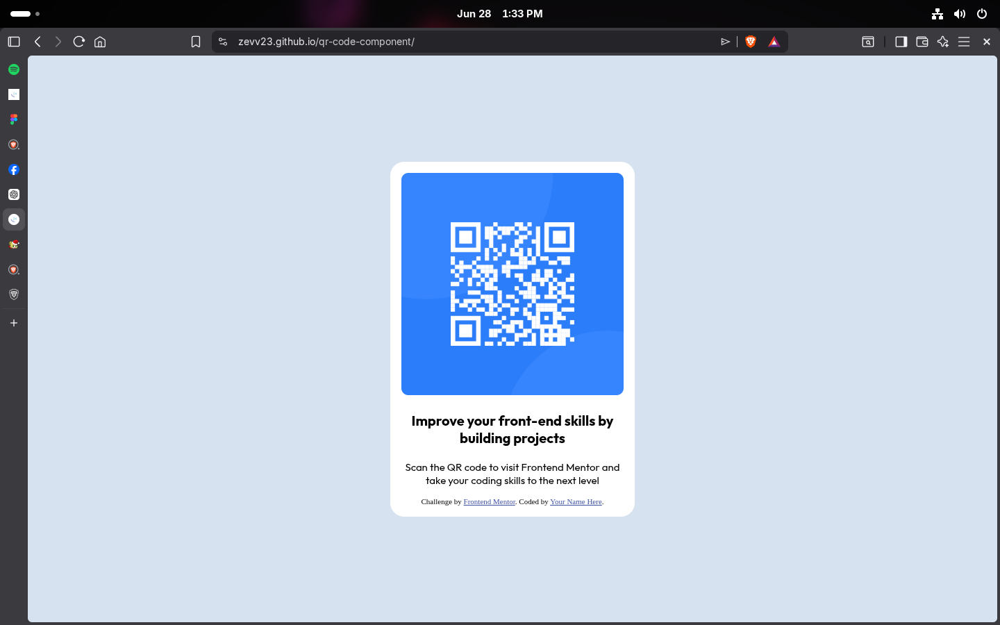

# Frontend Mentor - QR code component solution

This is a solution to the [QR code component challenge on Frontend Mentor](https://www.frontendmentor.io/challenges/qr-code-component-iux_sIO_H). Frontend Mentor challenges help you improve your coding skills by building realistic projects.

## Table of contents

* [Overview](#overview)

  * [Screenshot](#screenshot)
  * [Links](#links)
* [My process](#my-process)

  * [Built with](#built-with)
  * [What I learned](#what-i-learned)
  * [Continued development](#continued-development)
  * [Useful resources](#useful-resources)

## Overview

### Screenshot



### Links

* Solution URL: [Add solution URL here](https://your-solution-url.com)
* Live Site URL: [Add live site URL here](https://zevv23.github.io/qr-code-component/)

## My process

### Built with

* Semantic HTML5 markup
* CSS custom properties
* Flexbox
* Mobile-first workflow
* Google Fonts (Outfit)

### What I learned

This challenge helped me improve my understanding of HTML and CSS by recreating a design from a provided mockup. I learned how to center content using Flexbox, apply custom fonts from Google Fonts, and style a card component with proper spacing and typography.

```css
body {
  margin: 0;
  min-height: 100vh;
  display: flex;
  justify-content: center;
  align-items: center;
}
```

### Continued development

In future projects, I want to continue improving my responsive design skills and become more confident with CSS layout techniques. I also want to learn more about CSS Grid and create more complex user interfaces.

### Useful resources

* [MDN Web Docs](https://developer.mozilla.org/) - This helped me understand Flexbox and CSS properties used throughout the project.
* [Google Fonts](https://fonts.google.com/) - This helped me learn how to import and use custom fonts in a webpage.


